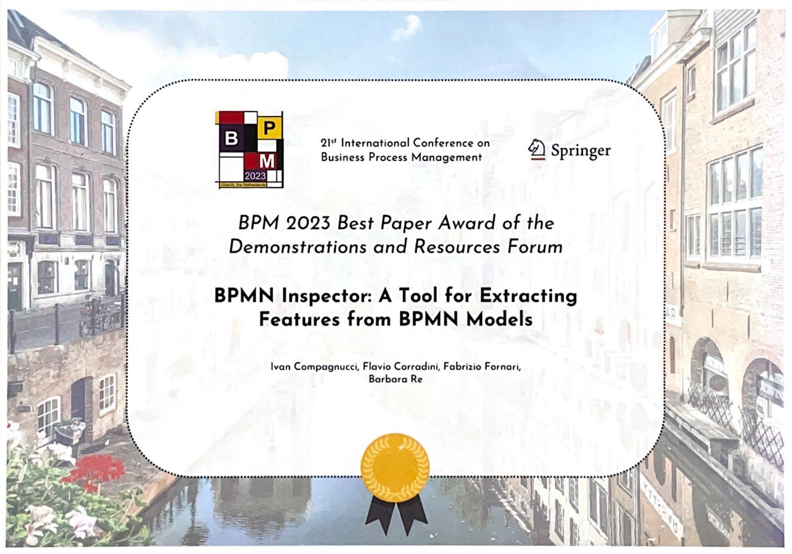

## 2023

## ▸ Best Paper Award of the Demonstrations and Resources Forum (BPM'23)

**BPMN Inspector** was awarded at the 21th International Conference on Business Process Management September 11-15 in: [BPM 2023 Best Paper Award of the Demonstration and Resources Forum ](https://bpm-conference.org/awards/) with the paper entitled: BPMN Inspector: A Tool for Extracting Features from BPMN Models. 

The contribution was mentioned for its noteworthy "potential impact on BPM
practitioners and educators" in the [BPM Newsletter of November 2023](https://bpm-conference.org/assets/docs/newsletter/BPM-newsletter-2023-11.pdf
). 

  

    
  

  

    
  

  <!-- Controlli sinistro e destro -->
  <a class="prev" onclick="plusSlides(-1)">&#10094;</a>
  <a class="next" onclick="plusSlides(1)">&#10095;</a>

   
   

