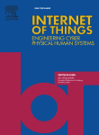
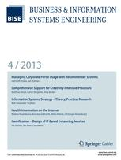

## Journals

  

     Fornari, F., <strong>Compagnucci, I.</strong>, De Donato, M. C., Bertrand, Y., Beyel, H. H., Carrión, E., Franceschetti, M., Groher, W., Grüger, J., Kilic, E., Koschmider, A., Leotta, F., Li, C.-Y., Lugaresi, G., Malburg, L., Mangler, J., Mecella, M., Pastor, O., Riss, U., Seiger, R., Serral, E., Torres, V., Valderas, P. (2025) "Digital Twins of Business Processes: A Research Manifesto". 
    <em>Internet of Things</em>, 30, 101477.
     
    [<a href="https://www.sciencedirect.com/science/article/abs/pii/S2542660524004189" target="_blank">Link</a>] [<a href="../assets/file/DTBP.pdf" target="_blank">PDF</a>]
  

  

  

     <strong>Compagnucci, I.</strong>, Corradini, F., Fornari, F., & Re, B. (2024). "A Study on the Usage of the BPMN Notation for Designing Process Collaboration, Choreography, and Conversation Models". <em>Business & Information Systems Engineering</em>, 66, 43–66.
     
    [<a href="https://link.springer.com/article/10.1007/s12599-023-00818-7" target="_blank">Link</a>] [<a href="../assets/file/BISE.pdf" target="_blank">Accepted Manuscript </a>]
  

  

  
  

     <strong>Compagnucci, I.</strong>, Corradini, F., Fornari, F., Polini, A., Re, B., & Tiezzi, F. (2023). "A systematic literature review on IoT-aware business process modeling views, requirements and notations". <em>Software and Systems Modeling</em>, 14(1), 1–36.
     
    [<a href="https://link.springer.com/article/10.1007/s10270-022-01049-2" target="_blank">Link</a>] [<a href="../assets/file/SLR2.pdf" target="_blank">Accepted Manuscript</a>]
  

  

## Conferences

   <strong>Compagnucci, I.</strong>, Pinciroli, R., & Trubiani, C. (2025). Performance Analysis of Architectural Patterns for Federated Learning Systems. Accepted for the 22nd IEEE International Conference on Software Architecture. ICSA 2025. Odense, Denmark, 31 March - 4 April 2025.
   
  [<a href="#" target="_blank">Link</a>] [<a href="../assets/file/FL.pdf" target="_blank">Accepted Manuscript</a>]
  
       
       
  

   <strong>Compagnucci, I.</strong>, Re, B., Snoeck, M., & Asensio, E. S. (2024). "A Digital Process Twin Conceptual Architecture for What-If Process Analysis" In Enterprise Design, Operations, and Computing. EDOC 2024 Workshops, Wien, Austria, September 10-13, 2024, Springer Nature Switzerland.
   
  [<a href="https://scholar.google.com/citations?view_op=view_citation&hl=it&user=pp6CqJoAAAAJ&citation_for_view=pp6CqJoAAAAJ:Y0pCki6q_DkC" target="_blank">Link</a>] [<a href="../assets/file/MIDAS.pdf" target="_blank">Accepted Manuscript</a>]

   <strong>Compagnucci, I.</strong>, Corradini, F., Fornari, F., & Re, B. (2023). BPMN inspector: A tool for Extracting Features from BPMN Models. In Proceedings of the Best Dissertation Award, Doctoral Consortium, and Demonstration & Resources Forum at BPM 2023 co-located with 21st International Conference on Business Process Management (BPM 2023), Utrecht, The Netherlands, September 11th to 15th, (Vol. 3469,pp. 122–126). CEUR-WS.org.
   
  🏆 <a href="https://ivancomp.github.io/awards/" target="_blank">BPM 2023 Best Paper Award of the Demonstrations and Resources Forum</a>
   
  [<a href="https://ceur-ws.org/Vol-3469/paper-22.pdf" target="_blank">PDF</a>]

   <strong>Compagnucci, I.</strong>, Snoeck, M., & Asensio, E. S. (2023). Supporting Digital Twins Systems Integrating the MERODE Approach. In Proceedings of the 26th International Conference on Model Driven Engineering Languages and Systems: Companion Proceedings, MODELS-C 2023, Västerås, Sweden, October 1-6, (pp. 449–458).
   
  [<a href="https://ieeexplore.ieee.org/abstract/document/10350700" target="_blank">Link</a>] [<a href="../assets/file/MODELS1.pdf" target="_blank">Accepted Manuscript</a>]

   Vemuri, P., Poelmans, S., <strong>Compagnucci, I.</strong>, & Snoeck, M. (2023). Using Formative Assessment and Feedback to Train Novice Modelers in Business Process Modeling. In Proceedings of the 26th International Conference on Model Driven Engineering Languages and Systems: Companion Proceedings, MODELS-C 2023, Västerås, Sweden, October 1-6, (pp. 449–458).
   
  [<a href="https://ieeexplore.ieee.org/abstract/document/10350391" target="_blank">Link</a>] [<a href="../assets/file/MODELS2.pdf" target="_blank">Accepted Manuscript</a>]

   <strong>Compagnucci, I.</strong>, Corradini, F., Fornari, F., & Re, B. (2021). Trends on the Usage of BPMN 2.0 from Publicly Available Repositories. In Perspectives in Business Informatics Research - 20th International Conference on Business Informatics Research, BIR 2021, Vienna, Austria, September 22-24, 2021. (Vol. 430,pp. 84–99).
   
  [<a href="https://link.springer.com/chapter/10.1007/978-3-030-87205-2_6" target="_blank">Link</a>] [<a href="../assets/file/BIR.pdf" target="_blank">Accepted Manuscript</a>]

   <strong>Compagnucci, I.</strong>, Corradini, F., Fornari, F., Polini, A., Re, B., & Tiezzi, F. (2020). Modelling Notations for IoT-Aware Business Processes: A Systematic Literature Review. In Business Process Management Workshops - BPM 2020 International Workshops, Seville, Spain, September 13-18, 2020. (Vol. 397, pp. 108–121).
   
  [<a href="https://link.springer.com/chapter/10.1007/978-3-030-66498-5_9" target="_blank">Link</a>] [<a href="../assets/file/SLR1.pdf" target="_blank">Accepted Manuscript</a>]

## Data and Artifacts

   <strong>Compagnucci, I.</strong>, Pinciroli, R., & Trubiani, C. (2025) "Open Science Artifact: Experimenting Architectural Patterns in Federated Learning Systems" 
   
  Zenodo DOI:  10.5281/zenodo.14938910 
   
  [<a href="https://zenodo.org/records/14938910" target="_blank">Link</a>]

   <strong>Compagnucci, I.</strong>, Pinciroli, R., & Trubiani, C. (2025) "Open Science Artifact: Performance Analysis of Architectural Patterns for Federated Learning Systems" 
   
  Zenodo DOI:  10.5281/zenodo.14539962 
   
  [<a href="https://zenodo.org/records/14539962" target="_blank">Link</a>]

   <strong>Compagnucci I.</strong>, Re B., Snoeck M., Serral E., (2024) "Simulation Models and Results for the EDOC 2024 Conference" 
   
  Zenodo DOI: 10.5281/zenodo.11005337 
   
  [<a href="https://zenodo.org/records/12671621" target="_blank">Link</a>]

