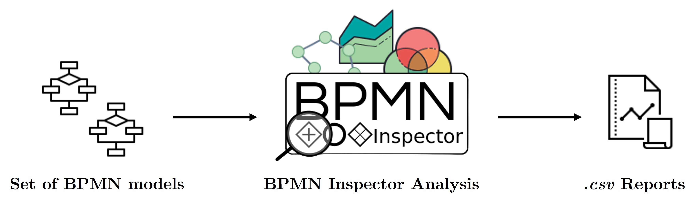

# About me

_Hello Folks_!

TODO

# Research

*   This is an unordered list following a header.
*   This is an unordered list following a header.
*   This is an unordered list following a header.

# Software

Here you can find the most important software developed during my career.

### BPMN Inspector

**BPMN Inspector**, is a web application designed to streamline the inspection process of BPMN models. The inspection process effectively distinguishes various
model types (i.e. collaboration, choreography, and conversation) while eliminating the need for manual effort in identifying duplicate models, validity issues, and
non-English models. In addition, BPMN Inspector provides detailed insights into
the collection of models by investigating the usage of BPMN notation elements,
their combinations, syntactic violations of the standard and the adherence to established good modeling practices.

[Repository Link](https://github.com/PROSLab/BPMN-Inspector) 

### BPMN Grader
(_In Development_)

**BPMN Grader** is a Java tool developed to assist teachers in correcting BPMN diagrams. The tool enables annotations to be added to images of BPMN models, indicating errors made by students while modeling the process. The Annotations that
can be included in the model are defined by a framework which includes common
errors when modeling BPMN diagrams. The aim is to provide graphic and immediate feedback to the student, improving their learning in BPMN process modeling.

[Repository Link](https://github.com/IvanComp/BPMN-Grader) 

# Awards

Here you can find the awards obtained during my career.

## BPM 2023 Best Paper Award of the Demonstrations and Resources Forum
**BPMN Inspector** was awarded at the 21th International Conference on Business Process Management September 11-15 in: [BPM 2023 Best Paper Award of the Demonstration and Resources Forum ](https://bpm-conference.org/awards/) with the paper entitled: BPMN Inspector: A Tool for Extracting Features from BPMN Models. 

The contribution was mentioned for its noteworthy "potential impact on BPM
practitioners and educators" in the [BPM Newsletter of November 2023](https://bpm-conference.org/assets/docs/newsletter/BPM-newsletter-2023-11.pdf
). 

# Interests
