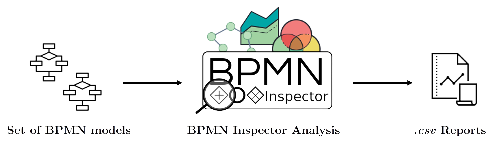
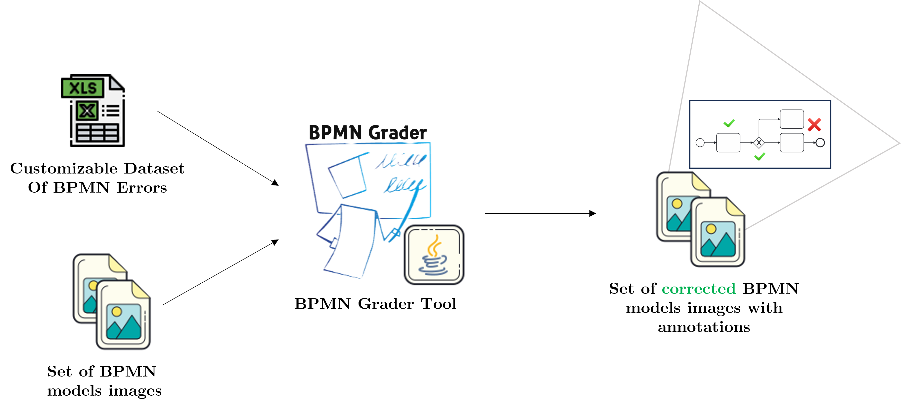

# About me

_Hello Folks_!

I’m Ivan Compagnucci, a Ph.D. candidate in Computer Science and Mathematics in the PROcesses & Services lab research
group at the University of Camerino. My research focuses on modeling and monitoring business
processes that integrate features, data and concepts concerning the Internet of Things (IoT) world.
The goal is to align enterprise or organization business processes with emerging IoT technologies,
aiming to achieve a synergy that enables continuous technology innovation.

# Research

Here you can find the research papers to request the .pdf file send me a request via email or on [ResearchGate](https://www.researchgate.net/profile/Ivan-Compagnucci).

## Journal Paper 

*   Compagnucci, I., Corradini, F., Fornari, F., & Re, B. (2023a). **A Study on the Usage of the BPMN
    Notation for Designing Process Collaboration, Choreography, and Conversation Models**. Business &
    Information Systems Engineering, In Press.

*   Compagnucci, I., Corradini, F., Fornari, F., Polini, A., Re, B., & Tiezzi, F. (2022). **A systematic literature
    review on IoT-aware business process modeling views, requirements and notations**. Software and
    Systems Modeling, 14(1), 1–36.

## Conference Paper

*   Compagnucci, I., Corradini, F., Fornari, F., & Re, B. (2023b). **BPMN inspector: A tool for extracting
    features from BPMN models**. In Proceedings of the Best Dissertation Award, Doctoral Consortium, and
    Demonstration & Resources Forum at BPM 2023 co-located with 21st International Conference on Business
    Process Management (BPM 2023), Utrecht, The Netherlands, September 11th to 15th, 2023 (Vol. 3469,
    pp. 122–126). CEUR-WS.org.

  * Compagnucci, I., Snoeck, M., & Asensio, E. S. (2023). **Supporting digital twins systems integrating the
    MERODE approach**. In Proceedings of the 26th International Conference on Model Driven Engineering
    Languages and Systems: Companion Proceedings, MODELS 2023, Västerås, Sweden, October 1-6, 2023
    (pp. 449–458). doi:10.1109/MODELS-C59198.2023.00079

  * Vemuri, P., Poelmans, S., Compagnucci, I., & Snoeck, M. (2023). **Using formative assessment and
    feedback to train novice modelers in business process modeling**. In Proceedings of the 26th International
    Conference on Model Driven Engineering Languages and Systems: Companion Proceedings, MODELS 2023,
    Västerås, Sweden, October 1-6, 2023 (pp. 449–458). doi:10.1109/MODELS-C59198.2023.00079

  * Compagnucci, I., Corradini, F., Fornari, F., & Re, B. (2021). **Trends on the usage of BPMN 2.0 from
    publicly available repositories**. In Perspectives in business informatics research - 20th international
    conference on business informatics research, BIR 2021, vienna, austria, september 22-24, 2021. (Vol. 430,
    pp. 84–99). doi:10.1007/978-3-030-87205-2\_6

  * Compagnucci, I., Corradini, F., Fornari, F., Polini, A., Re, B., & Tiezzi, F. (2020). **Modelling notations for
    iot-aware business processes: A systematic literature review**. In Business Process Management Workshops
    BPM 2020 International Workshops, Seville, Spain, September 13-18, 2020. (Vol. 397, pp. 108–121).
    doi:10.1007/978-3-030-66498-5\_9

# Software

Here you can find the most important software developed during my career.

### BPMN Inspector

**BPMN Inspector**, is a web application designed to streamline the inspection process of BPMN models. The inspection process effectively distinguishes various
model types (i.e. collaboration, choreography, and conversation) while eliminating the need for manual effort in identifying duplicate models, validity issues, and
non-English models. In addition, BPMN Inspector provides detailed insights into
the collection of models by investigating the usage of BPMN notation elements,
their combinations, syntactic violations of the standard and the adherence to established good modeling practices.

[Repository Link](https://github.com/PROSLab/BPMN-Inspector) 

### BPMN Grader
(_In Development_)

**BPMN Grader** is a Java tool developed to assist teachers in correcting BPMN diagrams. The tool enables annotations to be added to images of BPMN models, indicating errors made by students while modeling the process. The Annotations that
can be included in the model are defined by a framework which includes common
errors when modeling BPMN diagrams. The aim is to provide graphic and immediate feedback to the student, improving their learning in BPMN process modeling.

[Repository Link](https://github.com/IvanComp/BPMN-Grader) 

# Awards

Here you can find the awards obtained during my career.

## BPM 2023 Best Paper Award of the Demonstrations and Resources Forum
**BPMN Inspector** was awarded at the 21th International Conference on Business Process Management September 11-15 in: [BPM 2023 Best Paper Award of the Demonstration and Resources Forum ](https://bpm-conference.org/awards/) with the paper entitled: BPMN Inspector: A Tool for Extracting Features from BPMN Models. 

The contribution was mentioned for its noteworthy "potential impact on BPM
practitioners and educators" in the [BPM Newsletter of November 2023](https://bpm-conference.org/assets/docs/newsletter/BPM-newsletter-2023-11.pdf
). 

# Interests

TODO

## Books

## Podcast